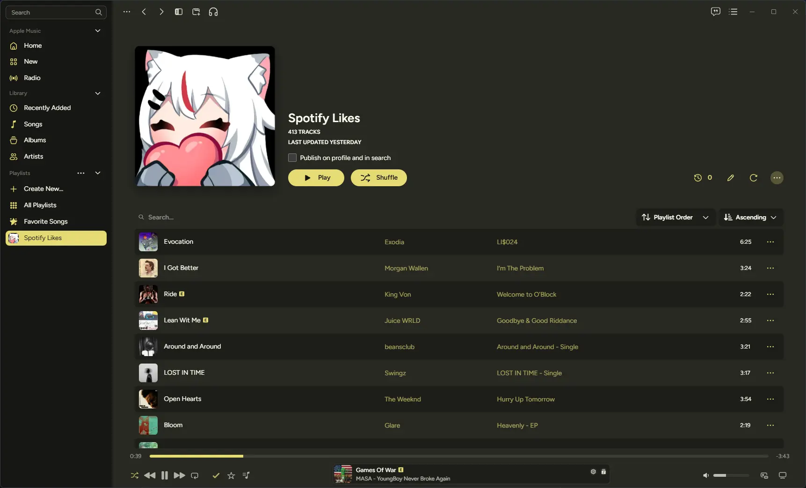
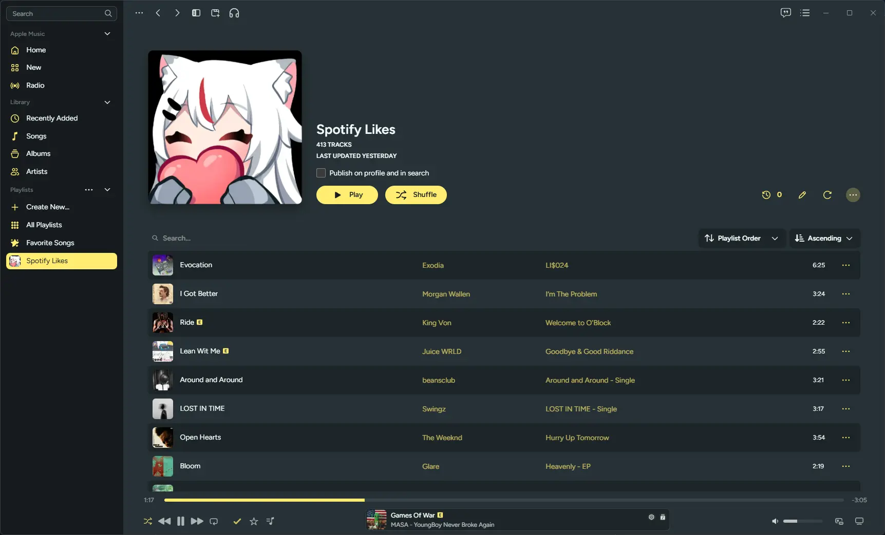
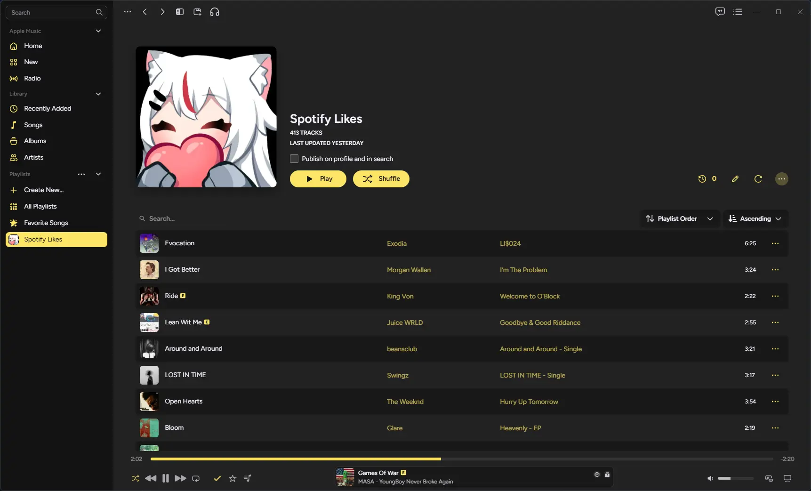
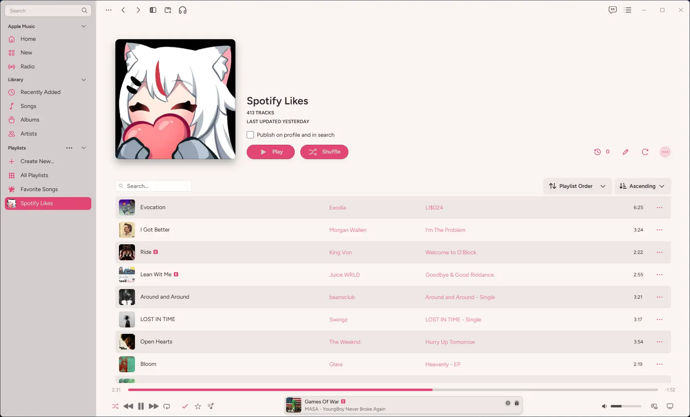
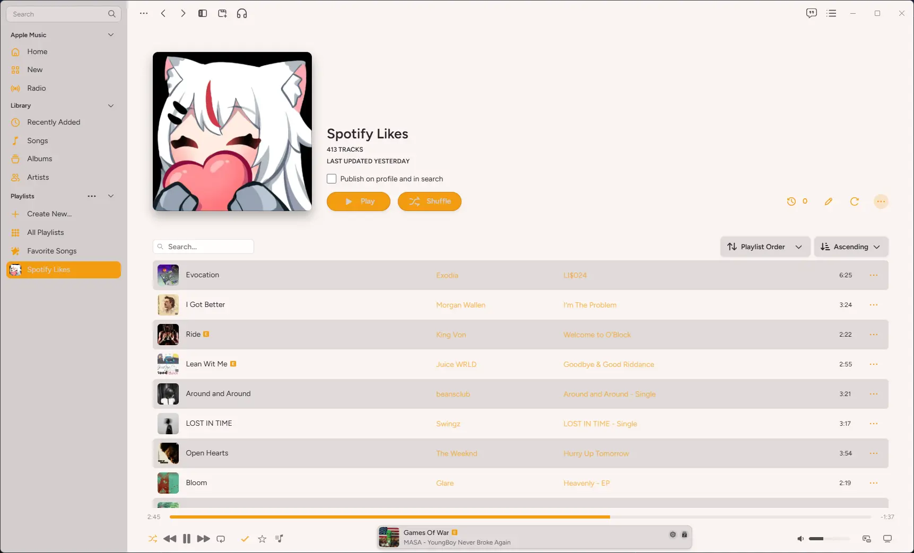

<h3 align="center">Monokai Pro for <a href="https://cider.sh/learn-more">Cider</a></h3>

	

## Previews

ㅤMonokai Classic

ㅤMonokai Pro

ㅤMonokai Pro (Filter Machine)

ㅤMonokai Pro (Filter Octagon)

ㅤMonokai Pro (Filter Ristretto)

ㅤMonokai Pro (Filter Spectrum)

ㅤMonokai Pro Light

ㅤMonokai Pro Light (Filter Sun)

## Usage

1. Open Cider
2. Menu → Settings → Extensions → Themes → 3 Dots → Open AppData Folder → Themes
3. Download Monokai Pro and place `monokai` folder in themes folder
4. Menu → Settings → Extensions → Themes
5. Enable the theme you like

## 💝 Thanks to

- [catppuccin](https://github.com/catppuccin/cider) (base theme)
- [monokai](https://monokai.pro/) (color scheme)
